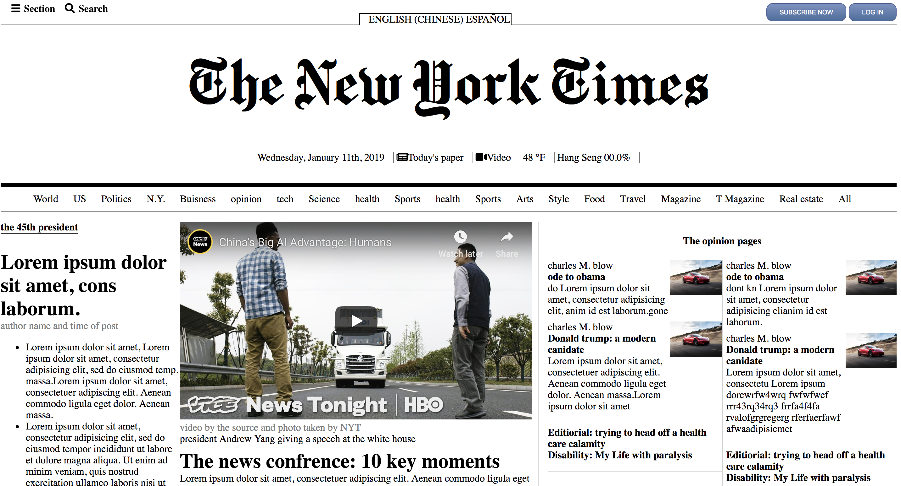

<h1> New York Times static site</h1>

 Developed the New York Times website with semantically structred HTML for greater accessibilty for users, and responsive CSS that looks great across all devices.

Link to project: https://nytpage.netlify.com

<h2>How It's Made</h2>
Tech used: HTML, CSS

The New York times site was one of the first projects I worked and truly struggled with. I'm glad I worked on it though because it forced me to really practice my craft. In this project I got a good understanding of how to use floats in order to position content and embedding video's.

